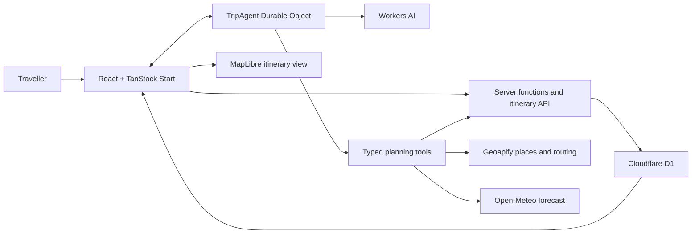

# Bhromon

**An AI trip-planning workspace that turns a traveller's idea into a grounded, route-aware itinerary they explicitly approve.**

Bhromon is built for independent travellers who want a journey shaped around their interests, pace, dates, and constraints—not a generic list of popular attractions. A traveller can begin without creating an account, refine the plan in a persistent conversation, review the proposed itinerary, and save a structured day-by-day trip with real places and mapped travel legs.

The project is intentionally focused on planning rather than bookings. Its purpose is to demonstrate a complete, thoughtful AI product: conversational discovery, tool-assisted planning, human approval, reliable persistence, and a calm interface that keeps the traveller's next decision at the centre.

## Product walkthrough

See Bhromon turn an open-ended weekend idea into a researched, weather-aware plan, request approval, save the itinerary, and present it as a mapped daily journey.

https://github.com/user-attachments/assets/bdcfd1d0-1ace-4bcb-8ea9-f34e3c552486

## Product experience

Bhromon supports the complete prompt-to-itinerary journey:

1. **Describe the trip naturally.** Start with a destination, a rough idea, or a detailed set of interests and constraints.
2. **Plan as a guest.** An anonymous account is created automatically, removing registration from the critical path.
3. **Refine the journey in chat.** A stateful trip-specific agent asks focused questions and remembers the conversation.
4. **Ground the recommendations.** Suggested stops are resolved to canonical places with coordinates and provider identifiers.
5. **Check the plan.** The agent can inspect weather, validate timing constraints, and optimize the order of stops using real routes.
6. **Approve before saving.** Persisting an itinerary is a human-controlled action, not an autonomous side effect.
7. **Review the result visually.** The confirmed trip is presented as a structured daily schedule with an interactive route map.
8. **Keep refining safely.** A newly approved itinerary supersedes the previous version without destroying its history.

### Available today

- Free-form trip creation with immediate transition into a dedicated planning workspace.
- Persistent, trip-specific AI conversations backed by a Cloudflare Durable Object.
- Guest-first access with a three-trip limit and account claiming without losing existing plans.
- Traveller-time-zone handling for relative dates and destination-local itinerary times.
- Short-range destination forecasts when weather is relevant to the plan.
- Canonical place grounding through Geoapify, with reusable place records and provider identities.
- Daily stop-order optimization using real routing while preserving fixed or traveller-constrained stops.
- Validation for opening hours, visit duration, schedule overlap, fixed bookings, meal windows, and travel time.
- Explicit approval, rejection, and revision of agent-proposed itineraries.
- Versioned confirmed itineraries with `draft`, `confirmed`, `superseded`, and `discarded` lifecycle states.
- Interactive MapLibre maps with ordered stops, route geometry, travel modes, and graceful routing fallbacks.
- Trip browsing and filtering by draft or confirmed status.
- Contextual first-visit tours plus intentional loading, empty, failure, and recovery states.

## What makes Bhromon different

### A planner, not a recommendation generator

Bhromon does not stop after producing attractive prose. Its agent works with structured places, dates, activities, timings, travel modes, route geometry, and revision state. The itinerary that reaches the database has crossed the same typed validation boundary used by the application.

### Real places before persistence

The save boundary rejects unresolved places. Every persisted visit must reference a canonical local place associated with an external provider identity, so the itinerary, map, and routing system operate on the same entities.

### Human approval as a product boundary

Saving an itinerary is configured as an approval-required agent tool. Travellers can inspect the proposed structured change before it becomes the current plan, avoiding silent AI writes and making revision behaviour understandable.

### Stateful planning without hiding history

Each trip has its own durable conversation state. Confirming a revision creates a new immutable version and marks the earlier current revision as superseded, preserving how the journey evolved.

### Time is treated as domain data

Bhromon distinguishes the current instant, traveller-local calendar context, and destination-local itinerary time. Relative dates are interpreted using the traveller's IANA time zone, while destination schedules remain destination-local instead of being accidentally shifted.

## System architecture

Bhromon is a full-stack TanStack Start application deployed as a Cloudflare Worker. The interactive application, server functions, API route, Durable Object agent, database access, and AI inference run within the Cloudflare platform.



### Agent toolchain

The trip agent uses a bounded tool loop with five purpose-built tools:

| Tool                | Responsibility                                                      | Reliability boundary                                                                         |
| ------------------- | ------------------------------------------------------------------- | -------------------------------------------------------------------------------------------- |
| `searchPlaces`      | Resolve recommendations to real destinations and points of interest | Returns canonical Geoapify-backed place records rather than model-invented coordinates       |
| `getWeather`        | Retrieve destination weather for a specific date                    | Uses a 16-day forecast horizon and reports unavailable forecasts explicitly                  |
| `planDailyRoutes`   | Optimize daily stop order using real route data                     | Keeps first, last, and explicitly locked stops fixed; supports bounded days and stops        |
| `validateItinerary` | Check whether the proposed schedule is workable                     | Evaluates timing, opening hours, minimum duration, bookings, meal windows, and transitions   |
| `saveItinerary`     | Persist the approved structured itinerary                           | Requires user approval, authentication, trip ownership, schema validity, and grounded places |

Model generations are capped at six steps per response. Tool inputs and itinerary outputs are validated with Zod, and cancellation signals propagate into external requests.

## highlights

### Guest-to-account continuity

Better Auth supplies both anonymous and email/password identities. Travellers can start immediately and later claim the anonymous account, preserving their existing trips rather than copying data between unrelated users.

### Versioned relational itinerary model

D1 stores the itinerary as relational domain data rather than one opaque AI response. The model includes trips, revisions, days, highlights, canonical places, visits, activities, and transitions. Database checks and unique indexes enforce important invariants, including:

- one current draft and one current confirmed revision per trip;
- monotonically numbered revisions;
- ordered days, visits, activities, highlights, and transitions;
- valid coordinates and valid itinerary status values;
- consistent revision ownership across days, visits, activities, and transitions.

### Routing with recoverable degradation

Geoapify supplies route optimization and geometry. Routing state is persisted per transition as `pending`, `routed`, `failed`, or `stale`. The itinerary can still render when a provider cannot return geometry, using a clearly differentiated fallback connection instead of losing the entire saved plan.

### Typed application boundaries

TanStack server functions form the client/server RPC boundary. Zod schemas are the source of truth for mutation inputs and agent tools, while TanStack Query provides canonical query keys, route preloading, cache reuse, and targeted invalidation.

### Operational visibility without sensitive logs

Structured lifecycle events cover agent generations, external calls, routing, durable work, itinerary writes, authorization failures, retries, and unexpected errors. Events include stable fields such as `tripId`, status, counts, duration, model usage, and step count while intentionally excluding prompts, chat content, credentials, cookies, and tokens.

Cloudflare observability and source-map uploads are enabled in the Worker configuration.

## Technology

| Area                   | Technology                                          | Role in Bhromon                                                                  |
| ---------------------- | --------------------------------------------------- | -------------------------------------------------------------------------------- |
| Application            | React 19, TypeScript 6, TanStack Start              | Full-stack rendering and application boundaries                                  |
| Navigation             | TanStack Router                                     | File-based routes, typed params, loaders, and preload behaviour                  |
| Server state           | TanStack Query                                      | Canonical caching, loader integration, invalidation, and suspense queries        |
| Agent runtime          | Cloudflare Agents SDK, Cloudflare AI Chat           | Durable trip-specific conversations and streaming chat                           |
| AI orchestration       | AI SDK 7, Workers AI                                | Typed tool calling, approval gates, streaming, and bounded multi-step generation |
| Models                 | GLM 4.7 Flash, Llama 3.1 8B Instruct Fast           | Trip conversation and concise title generation                                   |
| Database               | Cloudflare D1, Drizzle ORM                          | Relational trips, places, activities, routes, and itinerary revision history     |
| Authentication         | Better Auth                                         | Anonymous sessions, email/password accounts, and account claiming                |
| Validation             | Zod                                                 | Server inputs, agent tools, connection state, and itinerary schemas              |
| Place data and routing | Geoapify, OpenStreetMap data                        | Canonical places, route optimization, distance, duration, and geometry           |
| Weather                | Open-Meteo                                          | Destination geocoding and short-range daily forecasts                            |
| Maps                   | MapLibre GL, react-map-gl, CARTO basemap            | Interactive itinerary routes and numbered daily stops                            |
| Dates and time zones   | FormKit Tempo                                       | Calendar parsing, formatting, arithmetic, and time-zone-aware context            |
| Interface              | Tailwind CSS 4, shadcn, React Aria Components       | Accessible primitives and the custom nature-led visual system                    |
| Motion and guidance    | Motion, AutoAnimate, React Joyride                  | Transitions, list motion, and contextual product tours                           |
| Deployment             | Cloudflare Workers, Wrangler, Vite                  | Edge runtime, bindings, builds, migrations, and deployment                       |
| Quality                | ESLint, Prettier, strict TypeScript, React Compiler | Static analysis, formatting, and compile-time optimisation                       |

## Project structure

```text
src/
├── components/                 Shared application and UI primitives
├── config/                     Domain query-key and collection constants
├── db/                         Drizzle schema, relations, and D1 access
├── features/
│   ├── auth/                   Anonymous and registered account flows
│   ├── place/                  Place grounding and Geoapify integration
│   ├── product-tour/           First-visit contextual guidance
│   ├── site/                   Landing, About, and Contact experiences
│   ├── trip/                   Trip data, itinerary domain, routing, and maps
│   └── trip-chat/              Durable agent, tools, chat state, and UI
├── routes/                     Screens, loaders, and HTTP boundaries
├── styles/                     Global styles, typography, and fonts
├── utils/                      Cache, form, date, and time-zone utilities
├── router.tsx                  Router and Query integration
└── server.ts                   Cloudflare Worker and agent entry point

migrations/                     Versioned D1 schema migrations
public/                         Static assets and response headers
```

## Running locally

### Prerequisites

- Node.js with Corepack enabled
- pnpm
- A Cloudflare account with Workers AI access
- A Geoapify API key; its free plan does not require a credit card

### 1. Install dependencies

```bash
pnpm install
```

### 2. Configure local secrets

Copy the committed template and replace its safe placeholders:

```bash
cp .env.example .env
```

```dotenv
BETTER_AUTH_SECRET=replace-with-a-long-random-secret
BETTER_AUTH_URL=http://localhost:3000
GEOAPIFY_API_KEY=replace-with-your-geoapify-key
```

Never commit `.env` or secret values. The checked-in `.env.example` contains variable names and safe placeholders only.

### 3. Create the local database

```bash
pnpm db:migrate:local
```

### 4. Start the application

```bash
pnpm dev
```

Open [http://localhost:3000](http://localhost:3000).

If Workers AI cannot be reached locally, authenticate Wrangler with `pnpm exec wrangler login` and restart the development server.

## Commands

| Command                  | Purpose                                         |
| ------------------------ | ----------------------------------------------- |
| `pnpm dev`               | Start the Vite development server on port 3000  |
| `pnpm build`             | Create the client and Worker production bundles |
| `pnpm preview`           | Build and preview the production output         |
| `pnpm lint`              | Run ESLint                                      |
| `pnpm check`             | Verify formatting with Prettier                 |
| `pnpm format`            | Apply Prettier and ESLint fixes                 |
| `pnpm generate-routes`   | Regenerate the TanStack Router route tree       |
| `pnpm db:generate`       | Generate a migration from the Drizzle schema    |
| `pnpm db:migrate:local`  | Apply D1 migrations locally                     |
| `pnpm db:migrate:remote` | Apply D1 migrations to the production database  |
| `pnpm db:studio`         | Open Drizzle Studio for the local database      |
| `pnpm auth:generate`     | Regenerate the Better Auth schema               |
| `pnpm cf-typegen`        | Regenerate Cloudflare binding types             |
| `pnpm deploy`            | Build and deploy the Worker                     |

Before opening a change, run:

```bash
pnpm lint
pnpm check
pnpm build
```

Automated coverage for the core planning, routing, approval, and revision journeys is the next quality milestone.

## Database changes

The application schema lives in `src/db/schema.ts`, while generated migrations are committed under `migrations/`.

```bash
pnpm db:generate
pnpm db:migrate:local
```

Review generated SQL before applying it remotely. Drizzle Studio expects a local Wrangler D1 database, so apply the local migrations or start the development server first.

## Deployment

The application is configured for Cloudflare Workers with bindings for D1, Workers AI, and the `TripAgent` Durable Object. Production secrets are stored through Wrangler rather than committed to the repository.

Before the first deployment:

1. Create the production D1 database and configure its ID in `wrangler.jsonc`.
2. Set `BETTER_AUTH_URL` to the deployed origin.
3. Store `BETTER_AUTH_SECRET` and `GEOAPIFY_API_KEY` as Cloudflare secrets.
4. Apply the remote migrations.
5. Build and deploy the Worker.

```bash
pnpm exec wrangler login
pnpm exec wrangler secret put BETTER_AUTH_SECRET
pnpm exec wrangler secret put GEOAPIFY_API_KEY
pnpm db:migrate:remote
pnpm deploy
```

## Scope and product decisions

Bhromon is not intended to recreate a travel marketplace. Booking, payments, commissions, live inventory, social feeds, and broad productivity integrations are deliberate non-goals. The project prioritises a credible end-to-end planning experience over exhaustive destination or commerce coverage.

The next product priorities are realistic pacing warnings, accommodation anchors, transport context, trustworthy cost and source communication, read-only sharing, automated journey coverage, and a documented portfolio showcase.

See [ROADMAP.md](ROADMAP.md) for the ordered roadmap, [PRODUCT.md](PRODUCT.md) for the product principles, and [DESIGN.md](DESIGN.md) for the interface system.

## What this project demonstrates

Bhromon is a portfolio project built to demonstrate more than model integration:

- shaping an ambiguous consumer problem into a focused product journey;
- designing human-in-the-loop agent actions and safe persistence boundaries;
- modelling AI-generated output as validated, versioned relational data;
- coordinating real-time state, server rendering, database state, and external providers;
- handling time zones, routing degradation, authentication continuity, and recovery states;
- building a distinctive interface around the traveller rather than around the AI.

Contributions should follow [AGENTS.md](AGENTS.md), use conventional commits where practical, and remain scoped to the smallest useful vertical slice.
